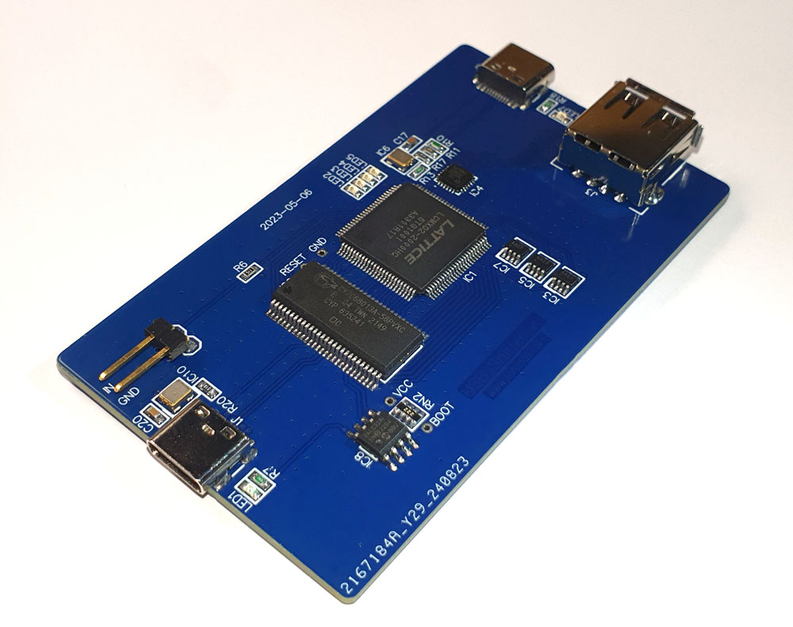
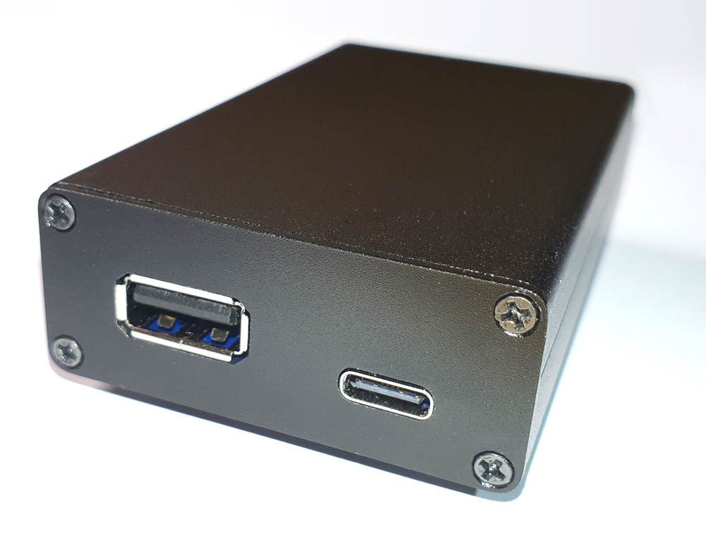

# Low-cost USB Sniffer (LS/FS/HS) with Wireshark interface

This is a fork of the [USB-Sniffer by Alex Taradov](https://github.com/ataradov/usb-sniffer). It uses his original PCB layout and his schematics. I've only added some [additional gerber files](bin/usb-sniffer_al-case-gerbers.zip) for a slightly larger PCB to fit inside a 80   ⃰50   ⃰20mm aluminum housing like [this one](https://aliexpress.com/item/1005006828585850.html):

 

Nothing else was changed or modified. Please refer to the [original repository of this amazing project](https://github.com/ataradov/usb-sniffer) for further information about getting everything to work.

There's also a great video:

... and a [blog post](https://www.downtowndougbrown.com/2023/08/building-alex-taradovs-open-source-usb-sniffer/) from Doug Brown giving some hints and tips for building and using this USB-Sniffer.

## Some final words and hints

I had some problems installing the generic WinUSB driver with the supplied dummy [INF file](bin/blank_fx2lp.inf) under Windows 11. Windows recognized the driver as compatible but for whatever reason refused to install it. So i used [Zadig](https://zadig.akeo.ie/) to force the installation of its WinUSB driver while also renaming the unknown USB device to 'blank_fx2lp'. It worked like a treat... and after that i was able to flash the firmware and program the FPGA.

Don't use EEPROMs from HGSEMI -> their cheaper prices are [not worth the hassle](https://github.com/ataradov/usb-sniffer/issues/45) ;) !

